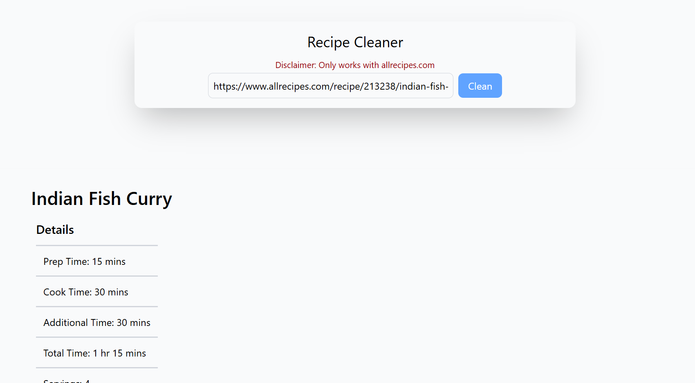

# Recipe Cleaner

## Purpose
Recipe sites such as allrecipes.com has too many ads and unnecessary content aside from the actual recipe. 

Therefore, this website allows the user to input a URL and retrieve just the most important parts.

Below is a screenshot of how the website looks like.



## How to Run this project
   1. Clone this Rep
   2. Open your terminal and run:
      ```bash
         cd RecipeCleaner
         npm run install-all
         npm run dev
   3. Go to http://localhost:5173/

## Tech Stack
React, Tailwind CSS, JavaScript (ES6+), Express, Playwright

## Future Improvements
 * Making an option to use Urls from other websites. 
 * Include pictures for the steps
 * Decrease scraping time
    * Can be done if we use a database 

